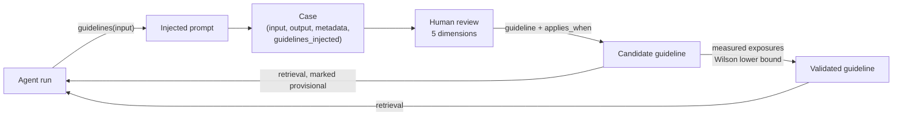
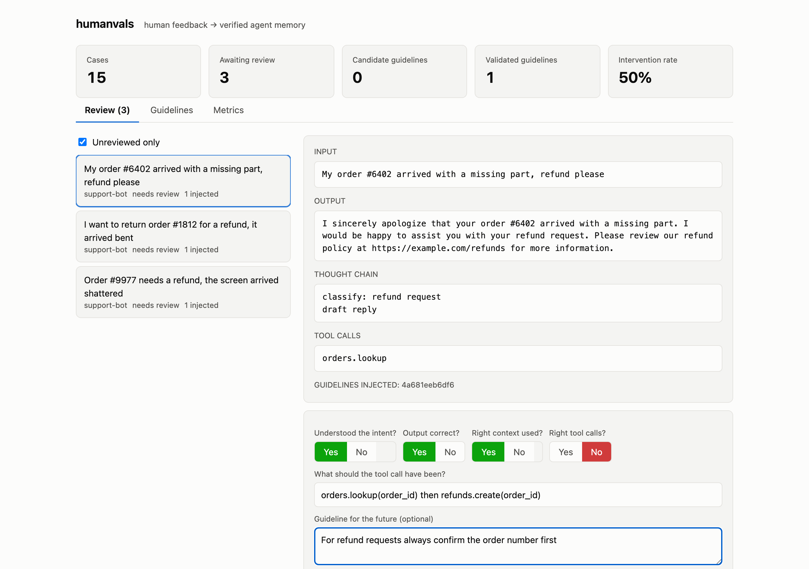
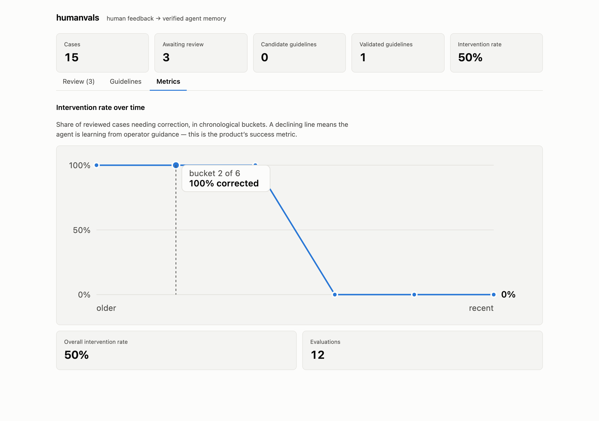

# humanvals

**Human feedback → verified agent memory.**

Your production agent produces outputs. Human operators correct them. Those
corrections evaporate. humanvals closes the loop: operator feedback becomes
retrievable guidelines, guidelines are injected into future runs under a strict
budget, every injection is measured, and only guidelines with **verified
positive impact** get promoted to the permanent knowledge layer.

> Human-approved is not verified-to-help. humanvals treats every guideline as a
> hypothesis that must earn permanence through measured outcomes.

Part of the [alinaqi RFC series](https://github.com/alinaqi/alinaqi/tree/main/docs) —
builds on [Engram RFC v3](https://github.com/alinaqi/alinaqi/blob/main/docs/Engram_RFC_v3.md).
The full concept: [docs/HumanVals_RFC.md](docs/HumanVals_RFC.md).

## How it works



1. **Capture** — every agent run is recorded as a *case* with its exposure log
   (which guidelines were injected). The exposure log is the backbone: all
   measurement joins through it.
2. **Review** — operators answer five questions per case: intent understood?
   output correct? right context? right tool calls (and if not, what the
   correct call would have been)? plus an optional *guideline for the future*
   with explicit `applies_when` scope.
3. **Learn** — guidelines are retrieved by intent similarity (precision-first:
   nothing beats something marginal), within a strict prompt budget, namespaced
   per agent. Near-duplicates and conflicts are surfaced to the reviewer at
   write time: reinforce, override (supersede — never delete), or scope both.
4. **Verify** — each later evaluation of a case is an impact measurement for
   every guideline that was injected into it. Promotion needs a Wilson 95%
   lower bound over real exposures — three thumbs-up is anecdote, not evidence.

## Install

```bash
pip install humanvals            # zero-dependency core (SQLite storage)
pip install 'humanvals[server]'  # + FastAPI review server
```

## Two-call integration

```python
from humanvals import HumanVals

hv = HumanVals('humanvals.db')

# 1. before your agent runs: fetch budgeted guidelines ('' at cold start)
gs = hv.guidelines(user_input, agent='support-bot')
prompt = SYSTEM_PROMPT + '\n' + gs.as_prompt()

# ... run your agent ...

# 2. after: record the case with its exposure log
hv.record_case(agent='support-bot', input=user_input, output=result,
               metadata={'thought_chain': steps, 'tool_calls': calls},
               guidelines=gs)
```

Works with any framework — runnable, key-free examples included:

| Framework | Example |
|---|---|
| Pydantic AI | [examples/pydantic_ai_agent.py](examples/pydantic_ai_agent.py) |
| LangGraph | [examples/langgraph_agent.py](examples/langgraph_agent.py) |
| CrewAI | [examples/crewai_agent.py](examples/crewai_agent.py) |

## Review dashboard

```bash
uvicorn humanvals.server.app:create_app --factory   # API + dashboard on :8000
```



Operators review cases (input, output, thought chain, injected guidelines),
answer the five dimensions, and add guidelines — with similar existing
guidelines surfaced inline before saving. The Metrics view tracks the
**intervention rate**: the share of reviewed cases needing correction. A
declining curve is the whole point.



## Lifecycle & promotion

| State | Meaning | Injected? |
|---|---|---|
| `candidate` | operator-stated, being measured | yes — marked *provisional* |
| `validated` | Wilson lower bound ≥ threshold over ≥ N exposures | yes — as instructions |
| `superseded` | overridden by a newer guideline (never deleted) | no |
| `rejected` | failed measurement | no |

```python
hv.run_promotions()                      # applies the policy; returns changes
HumanVals(policy=PromotionPolicy(min_exposures=10, promote_threshold=0.6))
```

## For AI agents

Integrating humanvals into a codebase with an AI coding agent? Point it at
[docs/AGENT_GUIDE.md](docs/AGENT_GUIDE.md) or [llms.txt](llms.txt) — both are
written for machine consumption with exact signatures and copy-paste recipes.

## Design

Every significant decision has an ADR in [docs/adr/](docs/adr). Highlights:

- **Zero-dependency core** — stdlib only; SQLite storage; pluggable `Store` and
  `Embedder` protocols (ADR-0003/0004)
- **Precision over recall** — a wrongly injected guideline corrupts the output
  *and* the measurement; the empty result is the default posture (ADR-0004)
- **Anti-pollution budget** — corpus growth never grows per-request context
  (ADR-0005)
- **Statistics, not vibes** — Wilson bounds with sample-size floors; evidence
  windows reset on promotion so each tier earns its keep (ADR-0006)
- **Supersede, never delete** — full audit trail (ADR-0007)
- Known limitations are stated plainly in [RFC §6](docs/HumanVals_RFC.md#6-known-limitations-v1-stated-plainly)

## Development

```bash
uv sync --all-extras
uv run pytest --cov=humanvals    # 59 tests, 98% coverage
uv run ruff check . && uv run mypy
cd dashboard && npm install && npm test && npm run build
```

## License

MIT © Ali Naqi Shaheen
